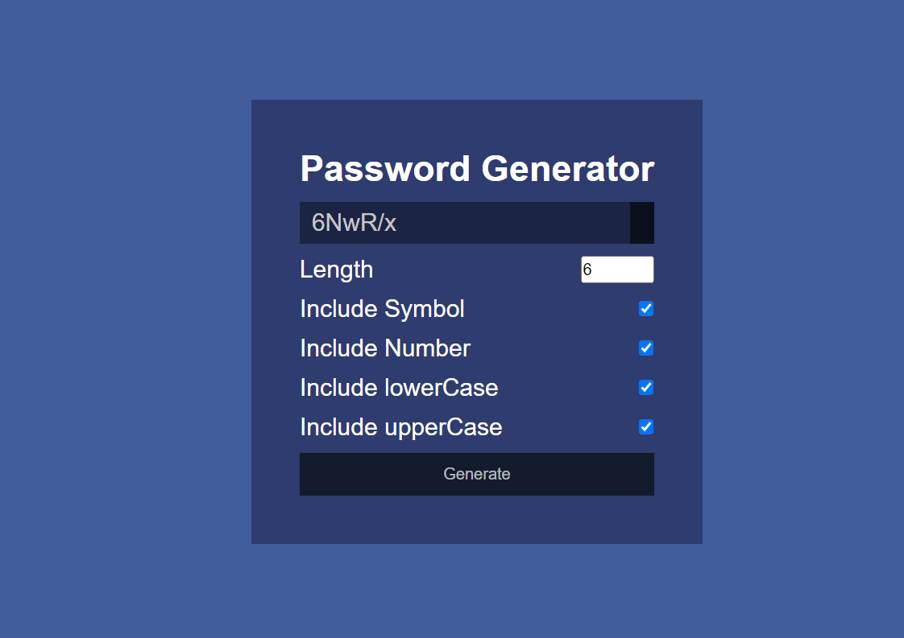

# 03 JavaScript: Password Generator

## Key Features

*Ability to check which components are included in the password

*Ability to generte a new unique password

## How To Use

1.) Check which components are to be included in the password 
2.) Click "Generate" button

## License

Refer to Git Repository

